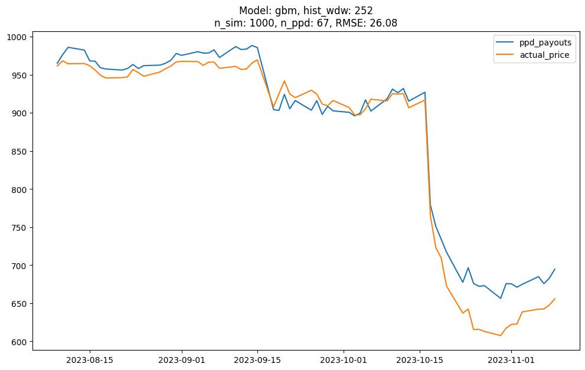

# Simulation and Analysis of a CHF Autocallable Barrier Reverse Convertible Product

## Introduction
This group project is part of the MH4518 Simulation Techniques in Finance module at Nanyang Technological University (NTU). Our focus was to employ Monte Carlo simulation techniques to estimate the risk-neutral price of a financial derivative tied to two correlated underlying assets over a three-month period, specifically involving shares of Lonza Group AG (LONN.SE) and Sika AG (SIKA.SE).

## Results
Our testing and comparison of several asset price models, against market prices as benchmarks, led us to determine that the multi-asset Geometric Brownian Motion (GBM) model produced the lowest Root Mean Squared Error (RMSE) in product price estimates, particularly when fine-tuned with a variety of hyperparameters.

## Navigation
### Within this Folder
- `code`: Contains subdirectories for each contributor's packages and scripts:
    - `sc`: Sze Chong's packages.
    - `sy`: Si Yuan's packages.
    - `yq`: Yi Qwan's packages.
- `data`: Stores bond, options, and product datasets.

## Usage
To execute simulations, initiate the process with `code/yq_script.py`. Ensure all dependencies are installed prior to running the simulations.

## Contribution
- **Bian Si Yuan**
    - Interest Rate Modelling
    - Variance Reduction Techniques
- **Khor Sze Chong**
    - Product Pricing
    - Sensitivity Analysis
- **Tang Yi Qwan**
    - Modelling of the Multidimensional GBM and Heston models 
    - Simulation of Share Price Paths
    - Hyperparameter Grid Search

## Future Improvements
- Integrate exogenous data for modelling LONN.SE shares.
- Enhance simulation efficiency.
- Refine calibration techniques.

## Contact Information
- [Yi Qwan](mailto:yiqwan.hi@outlook.com)